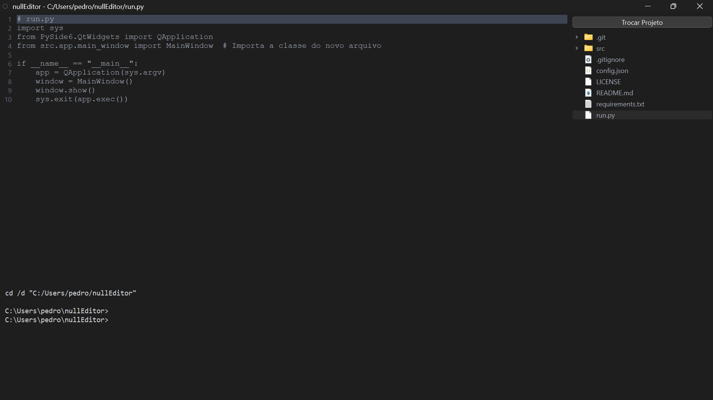

<p align="center">
  
</p>

<h1 align="center">nullEditor</h1>

Um editor de código minimalista e "arcaico" construído em Python e PySide6. O foco é forçar o usuário a interagir diretamente com suas ferramentas de desenvolvimento, sem "ajudas" de uma IDE moderna. A interação é feita primariamente pelo teclado, sem barras de menu.

Este projeto foi criado como um exercício de aprendizado pessoal.

## Screenshot



## Funcionalidades

* **Layout de 3 Painéis:** Editor de texto (centro), Explorador de Arquivos (direita) e Terminal (embaixo).
* **Editor "Burro":** Trata todo código como texto puro. Inclui numeração de linhas e destaque da linha atual.
* **Explorador de Arquivos:**
    * Permite abrir um diretório de projeto.
    * Ações com clique direito: Novo Arquivo, Nova Pasta, Renomear e Deletar.
    * Duplo-clique para abrir arquivos no editor.
* **Terminal Integrado:**
    * Um terminal (`cmd.exe` ou `/bin/bash`) que roda de forma persistente.
    * Sincroniza automaticamente (`cd`) com a pasta aberta no explorador.
    * Suporta comandos interativos (`python`, `git`, etc.).
* **Feedback Visual:** Um `*` aparece no título da janela se houver alterações não salvas.
* **Segurança:** Alerta o usuário antes de fechar ou abrir um novo arquivo se houver trabalho não salvo.
* **Personalização:** Todas as configurações de personalização ficam em um arquivo `config.json` externo.

## Atalhos de Teclado

* `Ctrl+S`: Salvar
* `Ctrl+Shift+S`: Salvar Como
* `Ctrl+O`: Abrir Arquivo

## Como Executar

1.  **Clone o repositório:**
    ```bash
    git clone https://github.com/lovepxdro/nullEditor.git
    cd nullEditor
    ```

2.  **Crie e ative um ambiente virtual:**
    ```bash
    python -m venv venv
    source venv/bin/activate  # (ou .\venv\Scripts\activate no Windows)
    ```

3.  **Instale as dependências:**
    ```bash
    pip install PySide6
    ```

4.  **Execute a aplicação:**
    ```bash
    python run.py
    ```

## Modificações Futuras

Aqui estão algumas ideias e melhorias planejadas para o `nullEditor`:

* Considerar a remoção de `Ctrl+Shift+S` e `Ctrl+O`.
* A seção do editor não deve iniciar no modo de escrita; deve aguardar um arquivo ser aberto.
* Adicionar a capacidade de abrir e gerenciar múltiplos terminais em abas.
* Aprimorar o terminal, incluindo o mau funcionamento do comando `clear`/`cls`
* Compilar o projeto em um executável (`.exe` ou similar) para facilitar a distribuição.
* Revisar toda a estrutura e código do projeto.